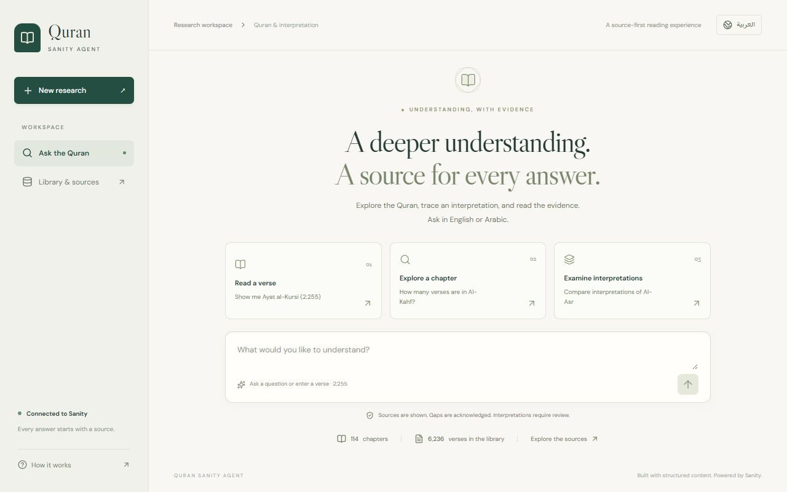
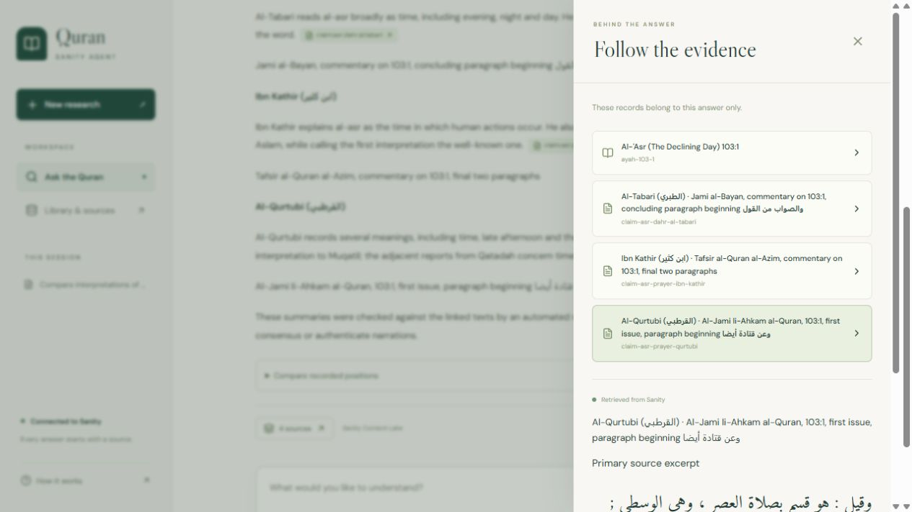

<div align="center">

<a href="https://quran-sanity.omar-afifi.com" target="_blank">
  
</a>

# Quran Sanity Agent

### *An Evidence-First Research Agent Powered by Sanity Content Lake & Sanity Context MCP*

<p align="center">
  
  
  
  
  
  
</p>

<p align="center">
  
  
  
  
  
  
</p>

<p align="center">
  <a href="https://quran-sanity.omar-afifi.com" target="_blank">
    
  </a>
  &nbsp;&nbsp;&nbsp;&nbsp;
  <a href="https://quran-evidence-studio.sanity.studio/" target="_blank">
    
  </a>
</p>

### *﴿ فَاسْأَلُوا أَهْلَ الذِّكْرِ إِن كُنتُمْ لَا تَعْلَمُونَ ﴾*
*“Ask the people of knowledge if you do not know.” — Surah An-Nahl (16:43)*

<p>
  <b>Insight through evidence. Verification without hallucination.</b><br/>
  <i>A bilingual Quran research workspace powered by Sanity Content Lake and Context MCP — delivering verified scripture, referenced commentary, and structured scholarly divergence.</i>
</p>

---

</div>

<br/>

## 🌟 The Vision

<table>
<tr>
<td width="50%" valign="top">

### ⚠️ The Problem

Standard AI models and generic RAG pipelines struggle in sacred and classical domains:

* **🎭 Probabilistic Verse Fabrication:** LLMs treat scripture as token sequences, dropping diacritics, swapping words, or inventing Arabic syntax from memory.
* **🌫️ Invented Scholarly Consensus:** When classical authorities disagree, conventional chatbots either smooth over centuries of debate with an imaginary consensus or blur opposing rulings into contradictory mush.
* **👻 Ghost Citations:** Generative models cite famous classical works (e.g. *Tafsir al-Tabari* or *Ibn Kathir*) with total confidence, even when the quote never existed in that work.
* **🔓 Ungrounded Context Chunks:** Generic RAG dumps unvetted text chunks into prompts, leaving the LLM free to hallucinate inferences outside the source excerpts.

</td>
<td width="50%" valign="top">

### ✅ The Solution

**Quran Sanity Agent** treats scripture and scholarship as immutable, structured records:

* 📖 **Verses Are Read, Never Generated:** The model is physically prohibited from reciting verses from memory. Every Ayah is pulled directly from an audited Sanity record matching the **Tanzil Uthmani 1.1** standard.
* ⚖️ **Structured Scholarly Divergence:** Classical disputes are modeled as first-class citizens in Sanity Studio, surfacing as **Contradictory (*Ikhtilaf Tadadd*)** or **Complementary (*Ikhtilaf Tanawwu'*)** side-by-side with exact locators.
* 🔍 **The Evidence Drawer:** Every verse and commentary card features an interactive badge opening a live drawer with the Sanity `_id`, physical book volume/page, and raw JSON payload.
* 🛡️ **Hard Editorial Gates:** Unaudited claims are quarantined in a `reviewQueue` in the Studio; the AI agent is mathematically blocked from seeing them until verified by a reviewer.

</td>
</tr>
</table>

<br/>

---

## ⚡ Core Architectural Pillars

### 1. Verses Are Read, Never Generated
The model is strictly prohibited from reciting Quranic verses from internal weights. Every single Ayah displayed in the interface is fetched directly from an audited Sanity record matching the **Tanzil Uthmani 1.1** standard (all 6,236 verses cryptographically audited against reference files).

### 2. Scholarly Disagreement as First-Class Data
Classical Islamic hermeneutics (*Tafsir*) has a rich tradition of scholarly debate. Rather than hiding or smoothing over these differences, the Sanity Content Studio categorizes claims into two distinct structures:
* **Contradictory (*Ikhtilaf Tadadd*):** Mutually exclusive scholarly positions (e.g. whether the opening *Basmalah* is counted as a verse of Al-Fatihah).
* **Complementary (*Ikhtilaf Tanawwu'*):** Harmonious, multi-faceted readings that coexist (e.g. whether *Al-Asr* refers to time itself or the afternoon prayer).

### 3. The Interactive Evidence Drawer
Every verse, translation, and commentary card features an interactive citation badge. Clicking it slides open the **Evidence Drawer**, revealing:
* The exact Sanity Document ID (`_id`).
* The physical book locator (chapter, volume, page, and verified web URL).
* The raw, immutable JSON payload straight from the Content Lake.

### 4. The Editorial Safety Gate
In [`studio/deskStructure.ts`](studio/deskStructure.ts), a custom **`reviewQueue`** (`Needs source review`) quarantines any claim that lacks a primary-source excerpt, locator, or reviewer sign-off. The Next.js agent's GROQ queries filter strictly for `reviewStatus in ["source_checked", "reviewed"]`, making unverified claims mathematically invisible to the AI.

### 5. Grounded Semantic Retrieval via Sanity Context MCP
For conceptual questions (e.g. *"What does the Quran say about justice even against oneself?"*), the agent queries the remote **Sanity Context MCP endpoint** indexing **21,398 library chunks** with vector embeddings. To ensure zero semantic drift, candidate IDs are re-fetched from the Content Lake, and AI reading notes are strictly required to quote the source text verbatim.

---

## 📱 Interface Showcase

<div align="center">

| 🌐 Bilingual Research Workspace | 🔍 The Live Evidence Drawer |
| :---: | :---: |
|  |  |
| *Arabic RTL & English LTR interface with verified Uthmani scripture, translation, and structured divergence views.* | *Zero-trust transparency: Inspect Sanity Document IDs, physical book locators, and raw JSON payloads.* |

</div>

<br/>

---

## 🏗️ Architecture: Hybrid Precision Retrieval

```
┌────────────────────────────────────────────────────────────────────────┐
│                          SANITY CONTENT LAKE                           │
│   • 114 Surahs (Surah number, names, revelation type)                  │
│   • 6,236 Ayahs (Uthmani text, translation, keywords)                  │
│   • 6 Tafsir Authorities (Scholar, death year, methodology)            │
│   • 12 Audited Interpretive Claims with primary excerpts               │
│   • 21,398 Classical Library Chunks & Commentaries                     │
└──────────────┬──────────────────────────────────────────┬──────────────┘
               │                                          │
      Exact Lookups (GROQ)                       Semantic Queries (MCP)
               │                                          │
               ▼                                          ▼
┌──────────────────────────────┐          ┌──────────────────────────────┐
│   Deterministic Lake Fetch   │          │  Sanity Context MCP Endpoint │
│  • Sub-50ms query response   │          │  • 21,398 library chunks     │
│  • Direct schema joins       │          │  • Vector embeddings rank    │
└──────────────┬───────────────┘          └──────────────┬───────────────┘
               │                                         │
               └────────────────────┬────────────────────┘
                                    ▼
┌────────────────────────────────────────────────────────────────────────┐
│                        NEXT.JS AGENT WORKSPACE                         │
│  • Verifies all candidate IDs against authoritative Lake records       │
│  • Enforces Verbatim Quotation Quarantine (rejects unquoted notes)     │
│  • Renders Bilingual Divergence Cards & Interactive Evidence Drawer    │
└────────────────────────────────────────────────────────────────────────┘
```

1. **Deterministic Lookups (GROQ):** Queries for specific verses or chapters (`2:255`, `البقرة ٢٥٥`, *"How many verses in Al-Kahf?"*) execute direct GROQ queries against the Content Lake, streaming verified text in under 50ms with zero generative risk.
2. **Semantic Queries (Context MCP):** Thematic questions query the remote Sanity Context MCP endpoint, which ranks relevant chunks across the 21,398-document library. Candidate IDs are then re-verified against the Content Lake before rendering.

---

## 📚 Sanity Content Model (`studio/schemaTypes/`)

The Studio schema models centuries of classical Islamic scholarship into structured documents:

| Schema Type | Purpose | Key Attributes |
| :--- | :--- | :--- |
| **`surah`** | Master chapter records (114 documents). | `number`, `nameArabic`, `nameEnglish`, `revelationType`, `totalAyahs` |
| **`ayah`** | Master verse records (6,236 documents). | `surah` (ref), `ayahNumber`, `textUthmani`, `textEnglishTranslation`, `keywords` |
| **`tafsirSource`** | Classical scholarly authorities (6 documents). | `author`, `bookTitleArabic`, `bookTitleEnglish`, `deathYearAH`, `methodology` |
| **`interpretiveClaim`** | Atomic scholarly assertions (12 curated). | `ayah` (ref), `source` (ref), `primaryExcerpt`, `sourceLocator`, `sourceUrl`, `divergenceType`, `reviewStatus` |
| **`sourceEdition`** | Provider and licensing metadata for editions. | `edition`, `title`, `language`, `provider`, `verifiedAt`, `rightsStatus` |
| **`libraryChunk`** | Ingested commentary sections for MCP (21,398 documents). | `edition` (ref), `chunkIndex`, `surahNumber`, `ayahNumber`, `text` |

---

## 💡 Example Explorations

Try these queries in the live application at [quran-sanity.omar-afifi.com](https://quran-sanity.omar-afifi.com) to observe the pipeline in action:

1. **Exact Verse Integrity:**
   * Query: `2:255` *(or in Arabic: `البقرة ٢٥٥`)*
   * *Result:* Instant retrieval of Ayat al-Kursi with verified Tanzil Uthmani script and Saheeh International translation. Click the citation badge to inspect `ayah-2-255` in the Evidence Drawer.
2. **Contradictory Divergence (*Ikhtilaf Tadadd*):**
   * Query: `Compare interpretations of Al-Fatiha Basmalah`
   * *Result:* Displays the opposing classical positions of Ibn Kathir / Al-Qurtubi (not counted) vs. Fakhr al-Din al-Razi (counted as Ayah 1) side-by-side without blending.
3. **Complementary Divergence (*Ikhtilaf Tanawwu'*):**
   * Query: `Compare interpretations of Al-Asr`
   * *Result:* Surfaces the complementary readings of Al-Tabari (time in general), Ibn Kathir (human actions), and Al-Qurtubi (the afternoon prayer).
4. **Semantic Retrieval via Sanity Context MCP:**
   * Query: `What does the Quran say about justice even against oneself?`
   * *Result:* Sanity Context MCP ranks Ayah 4:135 first, displaying the verse alongside grounded reading notes quoting the primary text verbatim.
5. **Honest Evidence Gap:**
   * Query: `What are the scholarly consensus rulings on cryptocurrency mining?`
   * *Result:* The agent declines to invent a fatwa, outputting an explicit **Evidence Gap** card showing that no matching classical records exist.

---

## 🚀 Getting Started

### Prerequisites
* **Node.js** 20.x or 22.x
* **npm** 10.x or higher

### 1. Clone & Install
```bash
git clone https://github.com/OmarAfifi-CSE/quran-sanity-agent.git
cd quran-sanity-agent

# Install dependencies across all workspaces
npm install
```

### 2. Environment Setup
Create a `.env.local` file inside the `web/` directory:
```bash
cp web/.env.example web/.env.local
```

Configure your credentials:
```env
NEXT_PUBLIC_SANITY_PROJECT_ID="qkca243t"
NEXT_PUBLIC_SANITY_DATASET="production"
NEXT_PUBLIC_SANITY_API_VERSION="2025-01-01"
SANITY_API_READ_TOKEN="your_sanity_read_token"
SANITY_CONTEXT_MCP_URL="https://api.sanity.io/v1/context/organizations/.../mcp/quran-evidence-mcp"
GEMINI_API_KEY="your_gemini_api_key"
```

*(Note: The repository includes bundled local reference fallbacks, allowing deterministic testing even without cloud credentials).*

### 3. Run Locally
```bash
# Start Next.js Web Frontend (http://localhost:3000)
npm run dev

# Start Sanity Studio (http://localhost:3333)
npm run dev:studio
```

### 4. Verification & Quality Gates
```bash
# Run the 63 automated tests
npm test

# Run code linter
npm run lint

# Run TypeScript type-checking
npm run type-check

# Run data & scripture reference audits
npm run audit:data
npm run audit:text
```

---

## 📜 Data Attribution & Integrity

* **Arabic Quranic Text:** 100% verified against the authoritative **[Tanzil Project](https://tanzil.net/)** Uthmani 1.1 reference standard. Audited with zero character mismatches across all 6,236 verses.
* **English Translation:** Stored renderings match **Saheeh International** (Quran.com Resource 20).
* **Tafsir Authorities:** Classical Arabic texts attributed to *Jami' al-Bayan* (Al-Tabari), *Al-Jami' li-Ahkam al-Qur'an* (Al-Qurtubi), *Tafsir al-Qur'an al-Azim* (Ibn Kathir), *Mafatih al-Ghayb* (Al-Razi), *Al-Kashshaf* (Al-Zamakhshari), and *Al-Tafsir al-Muyassar* (King Fahd Complex).
* **Review Protocol:** Claims marked `source_checked` represent automated primary-text comparisons; they do not represent personal religious rulings or certified scholarly endorsements. See [DATA_LICENSE.md](DATA_LICENSE.md).

---

## 🏛️ Sanity Content Architecture

* **Project ID:** `qkca243t`
* **Dataset:** `production`
* **Hosted Studio:** [https://quran-evidence-studio.sanity.studio/](https://quran-evidence-studio.sanity.studio/)
* **Live Web App:** [https://quran-sanity.omar-afifi.com](https://quran-sanity.omar-afifi.com)
* **Built For:** [Dev.to Sanity Challenge 2026](https://dev.to/challenges/sanity-2026-09-16) (Path One: *Ship an Agent That Queries Real Content*)

---

## 👤 Author

Crafted with dedication by **Omar Afifi**:
* GitHub: [@OmarAfifi-CSE](https://github.com/OmarAfifi-CSE)
* Website: [omar-afifi.com](https://omar-afifi.com)
* Project Domain: [quran-sanity.omar-afifi.com](https://quran-sanity.omar-afifi.com)

---

<div align="center">
  <sub>Source code licensed under the <a href="LICENSE">MIT License</a>. Scripture &amp; commentary data governed by respective terms (see <a href="DATA_LICENSE.md">DATA_LICENSE.md</a>). Dedicated to accuracy, transparency, and the preservation of sacred knowledge.</sub>
</div>
